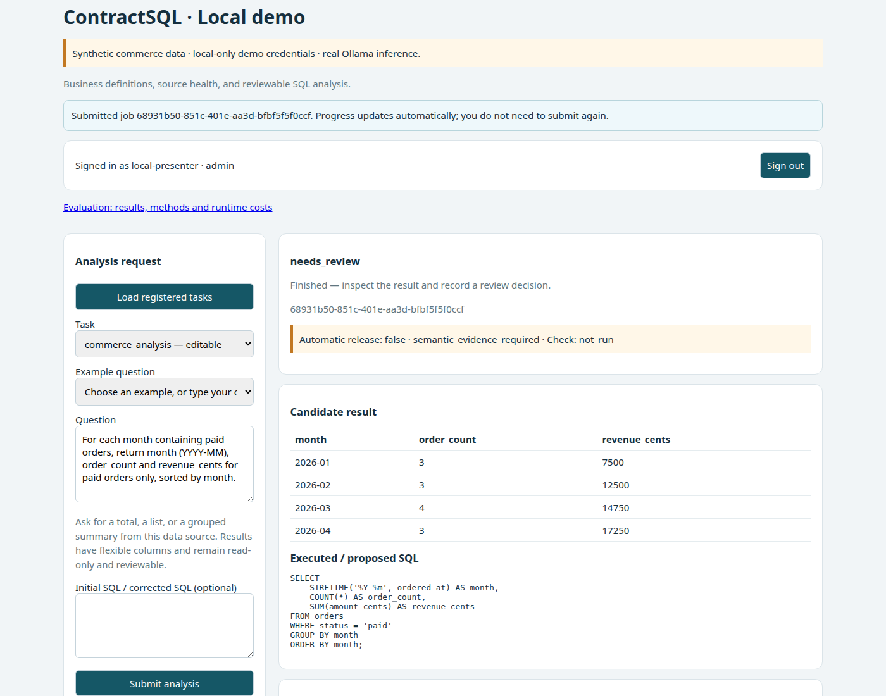
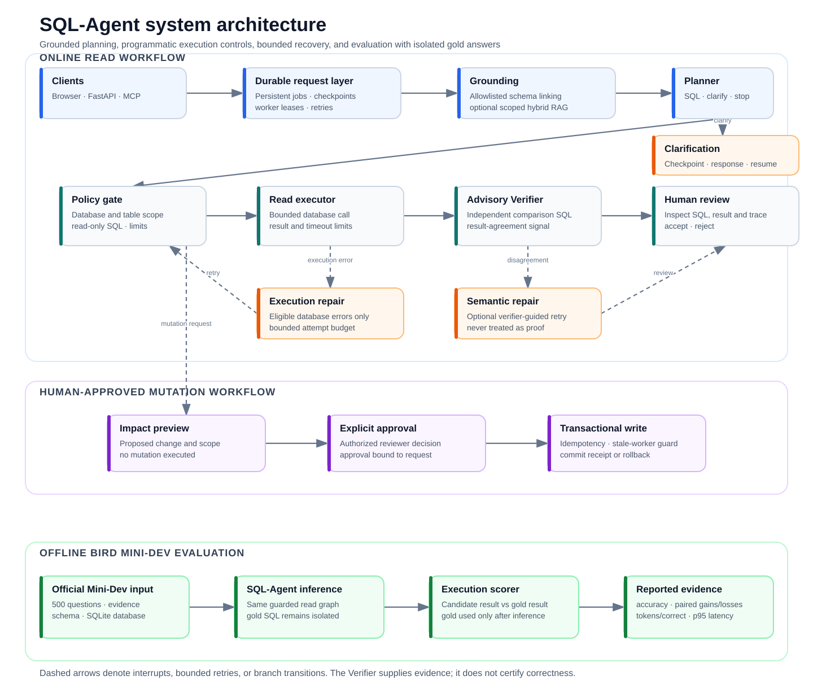

# SQL-Agent

**A LangGraph SQL agent with hybrid RAG, a Planner–Verifier workflow, and reproducible evaluation.**

[](https://github.com/jianghongcheng/SQL-Agent/actions/workflows/ci.yml)
[](LICENSE)

Turn business questions into SQL with scoped retrieval, schema-aware planning,
bounded repair, and an advisory independent Verifier for SQLite queries. Inspect
the generated SQL, execution history, and observed input/output token usage,
including failed calls and retries.

The browser and MCP share a checkpointed **LangGraph workflow** through an
asynchronous request API. Registered SQLite and PostgreSQL sources support
bounded queries and separately approved changes. Evaluation reports task accuracy,
verifier false accepts, latency, and tokens per correct task with public evidence.

[Supported database operations and approval boundaries](docs/USAGE.md#approved-database-changes)

[Quick start](#quick-start) · [Architecture](#architecture) · [Results](#evaluation) · [Usage](docs/USAGE.md)

### Latest measured results — September 9, 2026

**35/48 correct (72.9%) on an inspected SQL development set**, up from 21/48
(43.8%) after explicit population and aggregation-grain planning. These are six
known question families with eight data variants each, not blind generalization.

| Metric | Before | After |
| --- | ---: | ---: |
| Task accuracy | 21/48 (43.8%) | **35/48 (72.9%)** |
| Tokens per correct task, including spend on wrong/failed tasks | 6,629 | **4,250** |
| Client p95 latency | 5.85 s | 5.91 s |
| Verifier false accept: wrong candidates receiving agreement | 0/27 (0%) | **2/13 (15.4%)** |
| Human review rate | 100% | 100% |

Planner: **Qwen3 8B**; Verifier: **Qwen2.5-Coder 14B**; BM25 retrieval;
local RTX 3090; two workers. No general answer was automatically released.
The improvement fixes 15 cases and regresses one. Top-customer tie queries remain
**0/8**; verifier agreement does not establish correctness. Token cost per correct
task falls **35.9%**, while total workload tokens increase from 139,207 to 148,734.

[Full before/after results](docs/SQL_CORRECTNESS_REPAIR.md) ·
[Public metric evidence](docs/evidence/2026-09-09/README.md) ·
[Remaining correctness, production and generalization gates](docs/NEXT_QUALITY_GATES.md)

## Demo



The dashboard supports scalar answers, order lists, and grouped summaries.
The screenshot shows synthetic commerce data; the walkthrough includes six
[example questions and expected answers](docs/USAGE.md#six-questions-to-test-yourself).

## Architecture



The main path is **request → durable worker → scoped retrieval → schema linking →
Planner → read execution → independent Verifier → human review**. Database changes
branch into impact preview, administrator approval and transactional execution.
Clarification pauses the graph and resumes from persisted state.

The Verifier is advisory. General queries use separate bounded database reads;
registered contracted analysis tasks retain their own snapshot-preserving executor.
Only eligible SQL errors enter the bounded repair loop. The accounting layer records
input/output tokens across Planner, Verifier, failures and retries.

General database queries never auto-complete based on execution or model
agreement alone. SQLite natural-language requests receive an independent,
policy-restricted checker when available; separate snapshots make this advisory,
not proof. Explicit SQL without a question/model and PostgreSQL candidates also
require review. Registered business-verified tasks retain automatic completion.

SQL-Agent is a bounded, single-host prototype. PostgreSQL currently admits ordinary
tables with primitive columns, not arbitrary schemas, triggers or stored logic.
Historical accuracy results below evaluate SQLite analysis only; they do not
measure write-task or PostgreSQL accuracy.

### Retrieval-augmented SQL generation

Natural-language database requests can retrieve curated business definitions,
schema explanations and SQL examples before planning. Configurable hybrid retrieval
combines BM25 with local sentence embeddings and reciprocal-rank fusion. Both
branches filter by configured database and allowed tables before indexing, then supply bounded chunks with
source, version and content hashes. Evidence is checkpointed and returned with
the request. Explicit SQL skips retrieval; contracted tasks retain registered
definitions and snapshot-preserving analysis.

Hybrid mode uses token-aware or paragraph-bounded chunks, a model/content-addressed SQLite vector
cache, and exact cosine search (not a distributed vector database). An optional
local cross-encoder reranks fused candidates. BM25-only
mode remains available. Retrieved text cannot authorize SQL or bypass approval.
Synthetic retrieval smoke results are not SQL-answer accuracy or production evidence.
See [knowledge configuration](docs/USAGE.md#retrieval-augmented-generation-rag).

[Execution and recovery details](docs/RELIABILITY.md) · [Task registration](docs/USAGE.md#register-additional-tasks)

## Evaluation

Experiments report separate denominators and do not share one accuracy number.
Cost means input/output **tokens**, including failed calls and retries; missing
usage is unknown, not zero.

| Experiment | Measured result | Scope |
| --- | --- | --- |
| SQL planning repair | **21/48 → 35/48**; 15 fixes, 1 regression | Inspected development set; see headline metrics above |
| Retrieval-only BM25 → hybrid → reranking | Hit@1 **68.75% → 87.50% → 93.75%** | 16 synthetic retrieval queries; not SQL accuracy |
| Original end-to-end RAG comparison | BM25 **21/48**, hybrid **19/48**, reranked **19/48** | Pre-repair prompt; better retrieval did not improve SQL correctness |
| New 0.5B QLoRA training | **44/100 → 51/100**; 15 fixes, 8 regressions | Same source-labelled test set; adapter not promoted |
| Historical 1.5B QLoRA | **52/100 → 59/100**; 9 fixes, 2 regressions | Saved-run replay; not newly trained in this run |
| Local service load | **100/100** scripted jobs; p95 **0.698 s** | Concurrency 8; excludes LLM inference, not a production SLO |

[Local engineering acceptance](docs/STRONG_SIGNAL_RESULTS.md) ·
[QLoRA comparison and failure analysis](docs/SMALL_MODEL_COMPARISON.md) ·
[Protocols and reproduction](docs/EVALUATION.md)

**New holdout status:** runtime frozen; 60 new-domain tasks, 24 tie-ranking
challenges and 24 shared-error-risk cases are prepared. No completed, verified
holdout report is included in this release, so no blind accuracy is claimed.

The historical **91.0% (142/156)** result uses a different Qwen3 14B thinking
configuration and repeated development questions, with p95 **74.83 s**. It is
not the accuracy or latency of the current 8B/14B pipeline.
See [the historical protocol](docs/EVALUATION.md#qwen3-14b-configuration-comparison).

Recovery tests exercise worker termination, lease expiry, duplicate submission,
and stale-result rejection. They test service behavior separately from model accuracy.

## Quick start

Requires Python 3.10+, a running local Ollama service, and enough memory for
`qwen3:14b`. Install Ollama separately, then:

```bash
git clone https://github.com/jianghongcheng/SQL-Agent.git
cd SQL-Agent
python -m venv .venv
source .venv/bin/activate
pip install -e '.[dev]'
ollama pull qwen3:14b
python scripts/local_demo.py start --model qwen3:14b --generation-format sql --thinking --max-tokens 8192
```

Open **http://127.0.0.1:8765**, select **Enter local demo**, and use
`commerce_analysis`. The local-only key is `123`. Inspect SQL and results when
the job reaches `needs_review`, then record an approval or rejection.

```bash
python scripts/local_demo.py status
python scripts/local_demo.py stop
python -m pytest -q
```

**Stack:** Python, Ollama, SQLite, FastAPI, MCP, Docker, GitHub Actions.

## Scope

This release supports registered SQLite analytical sources and local deployment.
General SQL requires human review; fixed catalog tasks can use explicitly
registered reference queries. Service-wide roles are implemented, not multi-tenant
data isolation. See [operational limits](docs/RELIABILITY.md#operational-limits)
before deploying beyond a local environment.

[Usage](docs/USAGE.md) · [Evaluation](docs/EVALUATION.md) · [Contributing](CONTRIBUTING.md) · [MIT license](LICENSE)
