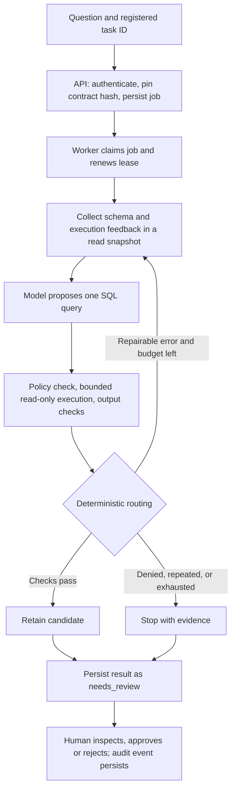

# ContractSQL — SQL Data Agent

Medical imaging measurement is maintained separately in
[RadMeasure](https://github.com/jianghongcheng/radmeasure-agent).
This repository preserves the shared project history but its current application
is SQL-only. Local raw validation runs, logs, runtime databases, and downloaded
datasets are intentionally excluded from this public release. Historical result
reports refer to local artifacts, not files bundled with a fresh clone.
See [public release validation](docs/PUBLIC_RELEASE_VALIDATION.md).
Install ContractSQL and RadMeasure in separate virtual environments: their
legacy Python module namespace is still shared.

Turn a natural-language question into a **reviewable, read-only SQL result**.
The default `commerce_analysis` task supports totals, order lists, and grouped
summaries with flexible result columns. ContractSQL connects a model to registered
SQLite sources, executes queries within
explicit limits, records evidence, and routes general answers to human review.

This is a local portfolio project, with real model inference and synthetic/public
evaluation data. It is not a claim of customer adoption or production SQL accuracy.

## Start here

- [Local demo setup and walkthrough](docs/LOCAL_DEMO.md)
- [Flexible analysis and small-scale product acceptance](docs/PRODUCT_ACCEPTANCE.md)
- [Configuration results and data robustness](docs/QUALITY_PROFILE_RESULTS.md)
- [Task registration and configuration](docs/SQL_TASKS.md)
- [Reliability and recovery boundaries](docs/RELIABILITY.md)

## Run the local demo

With Python 3.10+, Ollama running locally, and `qwen3:14b` installed:

```bash
git clone https://github.com/jianghongcheng/contractsql.git
cd contractsql
pip install -e '.[dev]'
PYTHONPATH=src:. python scripts/local_demo.py start --model qwen3:14b --generation-format sql --thinking --max-tokens 8192
```

Open **http://127.0.0.1:8765**, then click **Enter local demo**.
If using the key field, the local demo key is **`123`**. Select **`commerce_analysis`**
and try the questions below. Existing demo processes can be inspected with `status`
or stopped with `stop`. Credentials are for loopback demonstration only.

## Six questions to test yourself

Use **`commerce_analysis` for all six questions**. Paste only the question into
**Question**, leave **Initial SQL / corrected SQL** empty, and click **Submit
analysis** once. The page polls automatically. Wait for `needs_review`, inspect
**Candidate result** and **Executed / proposed SQL**, then expand the expected
answer below. `needs_review` is the normal outcome for this task, including a
correct answer; it is not an accuracy verdict.

These answers were independently calculated from the current local
`analytics.sqlite` and checked against the deterministic
[commerce fixture](scripts/commerce_acceptance_cases.py), seed **17**: 6 customers,
17 orders and 15 refunds. All amounts are **integer cents**. Rebuilding the demo
with the documented launcher recreates this fixture; answers must be recalculated
if you change the data. These are known manual regression questions, not a new
held-out benchmark. The answer keys are documentation and are not given to the
runtime Agent.

### 1. Paid revenue — scalar aggregation

```text
What is the total amount in cents of paid orders? Return one column named paid_revenue_cents; use zero if none exist.
```

<details>
<summary>Expected answer and what to check</summary>

| paid_revenue_cents |
|---:|
| 52000 |

Only `status = 'paid'` orders count. **58250** is the total across all orders,
including cancelled orders, and is wrong for this question. Refunds are not part
of the requested measure.

</details>

### 2. Filtered order list — status, amount and date boundaries

```text
List paid orders of at least 2500 cents placed on or after 2026-02-01 and before 2026-04-01. Return order_id, ordered_at, amount_cents, sorted by order_id.
```

<details>
<summary>Expected answer and what to check</summary>

| order_id | ordered_at | amount_cents |
|---:|---|---:|
| 2 | 2026-03-01 | 13500 |
| 4 | 2026-02-01 | 5000 |
| 11 | 2026-02-14 | 5000 |
| 13 | 2026-02-28 | 2500 |

Exactly four rows. February 1 is included; April 1 is excluded. Cancelled orders
15 and 17 meet the date/amount conditions but must not appear.

</details>

### 3. Monthly paid revenue — grouped counts and totals

```text
For each month containing paid orders, return month (YYYY-MM), order_count and revenue_cents for paid orders only, sorted by month.
```

<details>
<summary>Expected answer and what to check</summary>

| month | order_count | revenue_cents |
|---|---:|---:|
| 2026-01 | 3 | 7500 |
| 2026-02 | 3 | 12500 |
| 2026-03 | 4 | 14750 |
| 2026-04 | 3 | 17250 |

Zero-amount paid orders still count as orders. Counts sum to **13** and monthly
revenue sums to **52000**.

</details>

### 4. Customer net revenue — joins, refunds and missing data

```text
For every customer, return customer_id and net_cents: paid order amounts minus approved refund amounts on those paid orders. Count each order and refund once, ignore pending refunds, and use zero for absent or NULL amounts. Include customers without paid orders and sort by customer_id.
```

<details>
<summary>Expected answer and what to check</summary>

| customer_id | net_cents |
|---:|---:|
| 1 | 14500 |
| 2 | 14750 |
| 3 | 13000 |
| 4 | 8500 |
| 5 | 0 |
| 6 | 0 |

Keep all six customers. Avoid counting an order amount repeatedly when it has
multiple refund rows. Pending refunds do not reduce revenue; NULL amounts count
as zero. Customer totals sum to **50750**: 52000 paid revenue minus 1250 approved
refunds on paid orders.

</details>

### 5. Customers without paid orders — absence versus cancellation

```text
List customers who have no paid order. Return customer_id and name, sorted by customer_id. A cancelled order is not a paid order.
```

<details>
<summary>Expected answer and what to check</summary>

| customer_id | name |
|---:|---|
| 5 | Customer 5 |
| 6 | Customer 6 |

Customer 5 has no orders; customer 6 has only a cancelled order. Both qualify.
Having a cancelled order alone does not qualify a customer who also has paid orders.

</details>

### 6. Highest paid revenue — preserve ties

```text
Return all customers tied for the highest total paid order amount. Include customers with no paid orders as zero. Return customer_id and paid_cents, sorted by customer_id.
```

<details>
<summary>Expected answer and what to check</summary>

| customer_id | paid_cents |
|---:|---:|
| 1 | 14750 |
| 2 | 14750 |

Return both tied customers. An unconditional `LIMIT 1` loses a correct row.
This question asks for paid order amounts, so subtracting refunds is wrong.

</details>

### Record your results

Compare column names, ordered rows and values. A successful SQL execution alone
does not pass these checks. Record **Observed submit-to-result (this page)** from
**Run performance**, which includes queue wait and browser polling. Copy it before
reloading; reopening an old job does not reconstruct the browser measurement.

| Question | Job ID | Correct / incorrect / no candidate | Submit-to-result (ms) | Review / issue |
|---|---|---|---|---|
| 1 | | | | |
| 2 | | | | |
| 3 | | | | |
| 4 | | | | |
| 5 | | | | |
| 6 | | | | |

Enter a rationale before clicking **Approve review** or **Reject / request
correction**. Use **Open existing job** to reopen the job by ID and check **Full
evidence and audit history**. If you correct a question or SQL, submit a new job
and retain the original failure. Approval records your decision; it does not
rerun the query or establish an automatic correctness guarantee.

## Agent design

ContractSQL is a **single SQL Agent inside a durable application workflow**.
The model proposes a query; application code controls tool access, checks the
execution result, decides whether to repair or stop, and persists evidence.
There are five implementation layers:

| Layer | Responsibility | Implementation |
|---|---|---|
| 1. Interaction | Login, submit a question, poll progress, inspect results and record a review | [Dashboard](src/geomed_copilot/dashboard.py), [API](src/geomed_copilot/api.py), [MCP](src/geomed_copilot/mcp_server.py) |
| 2. Durable jobs | Idempotent submission, persistent job state, worker claims, leases and stale-result rejection | [Job store](src/geomed_copilot/jobs.py), [worker](src/geomed_copilot/worker.py) |
| 3. Task and context | Resolve a registered database and immutable output contract; collect schema and previous execution feedback | [Task registry](src/geomed_copilot/sql_config.py), [pipeline](src/geomed_copilot/pipeline.py) |
| 4. Agent loop | Generate SQL, execute an allowed tool, inspect feedback, retain a candidate, repair or stop | [SQL planner](src/geomed_copilot/native_sql.py), [DataAgentLoop](src/geomed_copilot/data_agent.py), [bounded runtime](src/geomed_copilot/bounded_runtime.py) |
| 5. Evidence and evaluation | Persist SQL, decisions, contract hashes, usage and review history; score results separately against offline answers | [Execution record](src/geomed_copilot/execution_record.py), [acceptance protocol](docs/PRODUCT_ACCEPTANCE.md) |

### Execution and repair loop



This diagram describes the default **`commerce_analysis`** task. Its collected
context is the question, database DDL, output constraints and previous SQL/error.
The read transaction keeps schema collection and repair queries on the same
SQLite snapshot. The model is Qwen3 14B through Ollama when launched with the
command above, with reasoning enabled, SQL-text output and a semantic checklist
for status filters, joins, NULLs and ties. That checklist guides generation; it
does not prove the answer.

The executor accepts one supported **SELECT** query and enforces registered
sources, read-only SQLite access, an authorizer, a VM execution budget and row
limits. This task permits **1–50 unique, nonempty result column names** and at most
**200 rows**. Columns vary with the question; the runtime does not mechanically
enforce question-specific aliases for this dynamic task. CTEs, writes and external
functions are outside the supported query policy.

The router returns `KEEP`, `REPAIR` or `STOP`. `KEEP` means the candidate passed
the configured checks. For general analysis, the pipeline still stores it as
`needs_review` with **Automatic release: false**. A valid query that omits a paid
status filter can pass structural checks; compare against the answer key above.

### Three separate retry budgets

| Mechanism | Default bound | What it does |
|---|---|---|
| SQL repair loop | 3 proposal rounds: first attempt + at most 2 repairs | Revisits selected execution/contract failures, supplying previous SQL and execution errors when available. Repeated identical proposals and policy denials stop early. |
| Model transport recovery | At most 3 HTTP attempts per model invocation | Retries eligible transient failures with backoff. The documented reasoning profile allows 120 seconds per request; this is not an end-to-end deadline. |
| Durable job recovery | At most 3 claims per job | Re-executes the whole read-only pipeline after eligible infrastructure failures or expired claims. Default lease is 300 seconds, renewed every 100 seconds. |

These budgets are different: three SQL rounds do not imply only three HTTP
requests. Model transport exhaustion inside the planner becomes a stopped result
for review; it does not automatically trigger all durable job retries. Worker
recovery repeats whole jobs and may repeat model cost. There is no mid-step model
checkpoint. An expired or superseded worker cannot overwrite the new owner's job.
Dynamic-column validation failures currently stop rather than retry, and not every
structural failure reason is explicitly included in the SQL-text repair prompt.

### Active features and optional modes

| Mode | Current behavior |
|---|---|
| `commerce_analysis` | Dynamic output, schema context, bounded generation/execution/repair, review and audit. No registered business definitions or source-health checks; the page reports this explicitly. |
| Fixed catalog metrics, such as `net_revenue` | Separate registered questions with business definitions, source checks and reference-query comparison. Successful reference checks can permit automatic release within that contract. |
| Independent model checker, relational planning and data probes | Experimental/alternative paths; none is enabled in the documented SQL-text demo profile. Their measurements are listed separately below. |

This is a Data Agent because it collects data context, chooses a SQL tool action,
observes execution feedback and makes a bounded next-step decision. One Agent is
enough for this loop. There is no vector-store RAG or multi-agent delegation in
the default design. Offline answer keys never serve as runtime verification for
general queries. The separate registered-reference mode must not be reported as
blind model accuracy.

Each submitted question is an independent job. The repair loop uses feedback
within that job; it does not provide conversational memory across questions.

The API persists jobs and review events. The local CLI uses the same pipeline
with a temporary job store; retain its JSON output if you need evidence. The local
demo uses SQLite for sources and jobs; a PostgreSQL job-store adapter exists but
has separate live-validation requirements.

[Architecture and book connection](docs/DATA_AGENT.md) · [Task registration](docs/SQL_TASKS.md) · [Reliability details](docs/RELIABILITY.md)

## Measured configuration choice

On **26 known development questions × 2 database instances × 3 trials**, the
selected reasoning configuration retained **142/156 correct candidates (91.0%)**,
versus 102/156 for the Coder baseline and 108/156 for non-reasoning Qwen3.
Its p95 latency was **74.8 seconds**, versus 2.23 seconds for non-reasoning;
the demo therefore uses an asynchronous job workflow. It still retained 13 wrong
candidates and stopped once. General answers require review.

The 35 originally correct billing candidates also passed 24 additional data
instances. These are synthetic regression results, not unseen public-benchmark
accuracy. Historical BIRD 500 results have **not** been rerun with this profile.
See [protocol, failures and tradeoffs](docs/QUALITY_PROFILE_RESULTS.md), or open
`/benchmark` on the demo for 864 recorded inference episodes across experiments.

## Experiments are not all enabled features

The default service stays separate from experimental generation strategies.
Relational planning and data probes are evaluated independently, not stacked.
SQL-text model evaluation is another controlled comparison.

| Completed experiment | Evidence-backed conclusion |
|---|---|
| [432-episode paired comparison](docs/PAIRED_SQL_BENCHMARK_RESULTS.md) | Independent checking rejected wrong and correct candidates; no answer-quality gain established |
| [Relational planning](docs/RELATIONAL_PLAN_EVALUATION.md) | 42/72 correct versus 39/72, twice the calls; small development result with substantial uncertainty |
| [Bounded data probes](docs/SQL_AGENT_WALKTHROUGH.md) | 137 successful probe queries; 38/72 correct versus 39/72, so not promoted |
| [Paper and implementation review](docs/SQL_ACCURACY_METHODS_RESEARCH.md) | Motivation and limitations, not locally reproduced paper scores |

All denominators describe the documented datasets and protocols. Repeated episodes
are not distinct questions. Model agreement and successful execution are not
correctness proofs. Previous BIRD data has been used during development.

## Verify and reproduce

```bash
python -m pytest -q
```

Benchmark runners write immutable run directories containing inputs, manifests,
source snapshots, responses, per-task outcomes and summaries. Follow the commands
in each dated report; do not overwrite a prior run or omit failed episodes.

For setup, see [local demo](docs/LOCAL_DEMO.md) and
[task configuration](docs/SQL_TASKS.md). Existing `radmeasure` commands and
`geomed_copilot` imports remain compatible. The current tree is SQL-only;
shared medical-project history remains accessible in Git.
