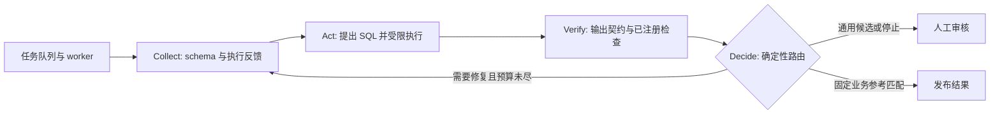

# ContractSQL 面试讲解与演示

## 一分钟主线

我做的是一个 SQL Data Agent：用户提出分析问题，系统在注册的数据源上生成并执行只读 SQL。重点是让结果可审查：执行权限、输出契约、有限重试、持久化任务和调用证据在同一条链路上。通用 SQL 不因为成功执行就自动发布；它进入人工审核。固定业务指标可以使用应用维护的参考查询检查当前结果，但这不是模型的通用准确率。

我用独立 Python 计算答案，记录全部成功、失败、重试和 token 消耗。实验里，增加计划调用或探查调用并没有稳定改善正确率，因此没有把它们堆进默认流程。完成模型与协议对照后，我在 26 个已知问题、两个数据实例、三次重复上比较配置：正确候选从 102/156 提高到 142/156，但 p95 延迟增加到 74.83 秒。因此选择异步执行与审核，而不是承诺即时、全自动回答。这个结果属于开发回归，不是生产准确率。

## 只讲一个四阶段循环

最终轨迹和审核记录持久化；目前不是每个中间步骤都做 checkpoint。只读权限与资源预算位于工具执行边界，模型不能自行放宽。

## 五分钟展示顺序

1. 打开本地首页，提交 `net_revenue`。解释金额单位、退款状态、只读执行，以及应用参考查询为什么可以检查这个固定指标。
2. 展示 `invoice_balance`：同一张账单有多笔收款和贷项，直接连接两张明细表会重复计数。看真实生成的 SQL 是否先按账单汇总，而不是用 `SUM(DISTINCT amount)` 丢弃金额相同的真实记录。
3. 看通用查询的 `candidate_output`、SQL 和 `needs_review`。它有可用候选结果，但没有语义正确的自动保证。
4. 提交 `blocked_stale`，展示数据质量检查在模型调用前阻止任务，并记录审核意见。
5. 打开实验报告：说明题目数、实例数、重复次数、错误保留、停止、修复与延迟。挑一个失败解释边界，不回避它。

## 一次真实的两轮修复

预检记录：`outputs/validation/quality_pilot_14b_v2/largest_ties.json`。

- 第一轮使用不存在的 `i.invoice_id`，SQLite 返回 `OperationalError`。
- 路由器决定 `REPAIR`，下一轮获得原 SQL 与执行错误。
- 第二轮使用实际字段 `i.id AS invoice_id`，保持每个账户的最大金额并列结果。
- 两次模型调用，独立评估在两个数据实例上核对最终查询。

这是一个真实修复案例，不是“所有错误都能修复”的证明。能执行但算错的 SQL，可能不触发任何执行错误；没有独立语义证据时，系统不能靠相同的执行检查发现它。

完整回归的 `quality_regression_v1/episode_0082.json` 还记录了一次三轮修复：第一轮错误引用 `i.invoice_id`；第二轮修正了 SELECT，却在 ORDER BY 里保留错误字段；第三轮两处都使用实际字段 `i.id`。三次调用耗时约 72.38 秒，最终查询在两个实例上通过。这个例子同时说明了有限重试的作用和额外成本。

## 面试追问

**为什么称为 Agent？** 模型提出工具动作，执行结果进入下一轮上下文，路由器可以要求修复或停止。持久化任务、权限和发布决策由应用管理。不是一个只返回 SQL 文本的聊天框。

**与 Data Agents on Databricks 的关系？** 借鉴显式契约、证据收集、有限执行与验证循环；当前实现聚焦只读 SQL，不声称实现整本书的平台，也没有 Databricks 部署经验。

**为什么没有多 Agent？** 这里并没有证据显示额外角色带来的调用成本能改善结果。工具与反馈循环已经满足此任务需求，核对器的误拒也需要单独评估。

**怎么评价输出？** 执行成功、形状契约、离线答案正确、审核发布是不同指标。离线比较包含行值、重复计数和两个实例上的同一 SQL；重复运行用于检查稳定性。已用于修复的题目是回归集。

**生产能力还缺什么？** 当前是本地工程项目。没有真实客户、线上 SLO、云端多租户运行证据；中间步骤也没有持久化恢复。模型可能返回可执行但错误的 SQL。应说明已经实现的控制和测量，不把它们叫做生产认证。

**你的贡献是什么？** 任务与契约边界、执行工具、修复路径、任务恢复、证据与审核流程、评估方法和基于结果的配置选择。公开模型是依赖，不把它的训练说成自己的工作。

## 两种岗位讲法

- Applied AI / Agent 后端岗位：重点讲端到端交付、工具接口、故障恢复、评估与成本取舍，并展示运行界面。
- 更偏平台的软件岗位：重点讲任务状态、租约与旧 worker 隔离、只读边界、幂等请求、监控和测试，再讲模型实验。这个项目不能替代算法与系统设计准备。

公司大小不等于岗位要求，也不等于录取难度。已有岗位证据样本很小，不能推算你的面试率。

## 与你提供的三本书逐项对照

页码为 PDF 阅读器从 1 开始计数的页码。

| 书中要求或架构 | 本项目对应的交付物 | 边界 |
|---|---|---|
| *Data Agents on Databricks*，第 5 章，PDF 62–64 页：Collect / Act / Verify / Decide，模型只是 Act 节点 | 读取 schema 和错误 → 模型提出 SQL → 工具与契约检查 → 确定性路由 | 契约验证不自动证明通用 SQL 的语义 |
| 同书第 16 章，PDF 210 页：明确讨论持久化与恢复方式 | 持久化任务、租约、失败重领、执行记录 | 不是书中的 Git 工件恢复，也未实现步骤级 checkpoint |
| *The 0–1 AI Engineer Interview Playbook*，第 3 章，PDF 27 页：有实质内容的项目、评估、部署、README、取舍与技术写作 | 一个 SQL 项目、真实本地服务、实验原始记录、运行说明、本讲解稿 | 本地部署不能冒充生产部署；书中对筛选机会的断言没有被本项目验证 |
| *The AI Engineer Handbook*，PDF 48–50 页：端到端原型、架构清晰、代码质量、产品问题、展示设计理由和限制 | 五分钟真实流程、模块边界、自动测试、账单汇总问题与失败解释 | 这些是准备原则，不是公司的统一录取标准 |

因此，继续改造的目标是让这一条工作流可靠、可测、可解释，而不是为了“符合书”增加 Databricks、多 Agent 或无依据的线上指标。
