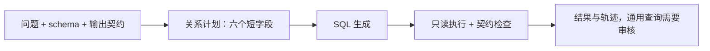

# 一项改动讲清楚：关系计划 → SQL → 受控执行

这是一项可关闭的生成策略实验，目的是减少可执行但语义错误的 SQL。没有增加多个 Agent、向量库、训练器或新的服务。文献依据见 [调研记录](SQL_ACCURACY_METHODS_RESEARCH.md)。本页的性能结论以实验产物为准。

## 已完成的结果（2026-09-06）

全部 144 次真实 qwen3:8b 运行完成，执行前固定源码、数据和顺序；完成后验证源码、数据与模型 digest 未变化，计划记录完整且无重复。

| 策略 | 正确保留 | 错误保留 | 停止 | 模型调用 | pipeline p95 |
|---|---:|---:|---:|---:|---:|
| 直接生成 | 39/72（54.17%） | 33 | 0 | 72 | 1.07 秒 |
| 先规划再生成 | 42/72（58.33%） | 26 | 4 | 144 | 2.72 秒 |

净增 3 个正确 episode，4.17 个百分点；按 12 个问题族聚类 bootstrap 的描述性区间为 −16.67 到 +29.17 个百分点，跨过零。两组实际成本不相等，不足以证明稳定泛化收益。4 次停止源于 SQL OperationalError 后达到单轮预算，并非计划格式错误。跨两份数据实例均正确的候选由 36 增至 42；这仍是有限开发数据。

结论：保留为可选实验，不替换服务默认生成策略。不把“58.33%”写成通用 SQL 或生产准确率。成功案例包括 delivered_by_region 的去重及零值保留；失败案例包括 march_deliveries 的计划误加保留要求，导致统计无关包裹。

产物目录：`outputs/validation/relational_plan_v1/`，包含 `manifest.json`、源码快照、144 份 episode、`summary.json`、`completion_audit.json` 和可逐条展开计划/SQL 的 `report.html`。全套回归 174 项通过，随后新增的 pipeline 计划轨迹测试连同相关测试 21 项通过。

## 只有三个阶段



默认基线跳过关系计划，其他机制不变。两个模型调用来自同一个 qwen3:8b；没有把它包装成两个独立专家。

六个字段：grain（每行代表什么）、relationships（关联及重复风险）、measure（统计对象）、conditions（筛选/存在性/日期）、preserve（需要保留的实体及空值）、ordering（排序）。它们是模型生成的简短设计说明，不是隐藏推理、标准答案或形式化证明。

## 代码入口与边界

- `src/geomed_copilot/relational_plan.py`：一次计划调用及严格字段检查。
- `ContractSQLPlanner(model, relational_plan=True)`：先计划再用原 SQL 生成逻辑；默认仍为 False。
- `DataAgentLoop`：在轨迹和执行记录中保存计划，标记 `model_draft_not_verified`。
- 计划格式错误会停止，不悄悄降级成成功；SQL 仍走原有只读、函数与资源限制。
- 服务的 verification_sql 在任何模型调用前被移除。离线评分答案不进计划、SQL 生成或在线执行检查。
- 不按题号或表名选择固定答案模板。计划本身也可能误解需求，必须通过实验评估。

## 当前实验如何复现

在仓库根目录、有本地 qwen3:8b 的情况下：

```bash
PYTHONPATH=src:. python scripts/run_paired_sql_benchmark.py \
  --output outputs/validation/relational_plan_new \
  --methods one_shot plan_then_sql --profiles clean --repeats 3
```

输出目录必须不存在。全部 24 个问题/数据组合 × 3 次完整重复 × 2 种策略 = 144 次运行。两种策略各只有一次最终 SQL 生成；规划策略多一次模型调用，不是等成本比较。共同传输恢复与九次调用尝试上限仍生效。此次先隔离语义生成因素，不重复注入已经评估过的暂态故障。

这些题已经用于开发，不是新的留出集。先通过本轮回归判断是否值得继续；泛化提升需要新冻结的问题/schema 验证。不能将开发集变化称为 BIRD 提升或生产效果。

每条 `episode_*.json` 包含计划、SQL、响应、用量、结果和跨数据实例评分；`summary.json` 包含完整汇总。挑一条成功和一条失败，分别解释计划与 SQL 是否一致，比只展示一个准确率更有说服力。

## 证据边界

当前结果支持在有限开发数据上分析正确性与调用成本，不证明生产准确率、未见数据泛化或线上收益。
