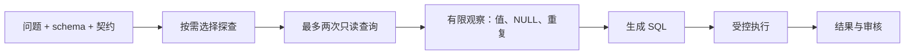

# SQL Data Agent：一条主线讲清楚

目标：把自然语言问题变成可审查的数据库查询；必要时先观察数据，用可复现实验衡量正确性，而不是把“执行成功”当作“回答正确”。

## 本轮完成结果（2026-09-06）

全部 144 次真实模型运行完成。源码与数据库哈希保持不变，模型 digest 前后一致；完整记录与计划逐项匹配且无重复。

| 策略 | 正确保留 | 错误保留 | 停止 | 模型调用 | pipeline p95 |
|---|---:|---:|---:|---:|---:|
| 直接生成 | 39/72（54.17%） | 33 | 0 | 72 | 1.13 秒 |
| 探查后生成 | 38/72（52.78%） | 32 | 2 | 144 | 2.40 秒 |

数据探查 137 条，全部执行成功；每个 episode 最多两条，没有触发执行器的输出截断。查询自身可能带 LIMIT，所以不代表样本覆盖全表。探查策略输入/输出 token 为 89,611/10,127，直接生成为 46,320/4,622。

正确保留率变化 −1.39 个百分点，按 12 个问题族聚类 bootstrap 的描述性区间为 −26.39 到 +25.00 个百分点；不能证明收益，也不能据此断言所有数据探查策略无效。两种策略跨两份数据实例均正确的候选都为 36/72。

决策：保留实现用于可审计工具调用与后续研究，不替换默认路径。不能写“数据探查提升准确率”。当前证据说明工具拿到数据不等于生成器正确利用证据；小 schema 上的语义错误仍未解决。下一轮应优先隔离 SQL 模型能力与候选生成能力，不继续叠加规划、探查和核对器。

产物在 `outputs/validation/data_probe_v1/`：源码快照、manifest、144 份原始 episode、summary、completion_audit、report.html 与 report.png。报告生成器拒绝缺项、重复及主要汇总计数不一致；Chrome 已验证 144 条轨迹和展开的探查证据。182 项回归测试通过。

## 面试讲解顺序

1. 用户提出问题，应用提供 schema 和输出契约。
2. 可选数据探查阶段：模型选择最多两条小型 SELECT，查看实际值、空值或关联键重复情况。
3. 系统在只读边界内执行探查，将有限的观察结果交给同一个模型生成最终 SQL。
4. SQL 经过现有权限、资源和输出契约检查；通用查询进入人工审核。
5. 记录问题、探查、观察、最终 SQL、执行结果与调用成本，离线独立评分。



这是同一模型使用数据库工具的流程，不是多个“专家”互相投票。数据探查目前是一轮有预算的观察，不是无限自主探索；后续 SQL 修复可复用这些观察，但不会重新探查。

## 什么是这轮增加的能力

之前模型只能看到表结构和执行错误。现在可选择查看真实数据，再据此生成 SQL。例如，先检查某状态列实际存储的值，或同一实体是否有多条事件记录。数据库观察可以纠正事实理解，但不会自动定义“有效订单”等业务概念，也不能自动证明最终答案正确。

代码入口：`data_probe.py` 实现选择与执行；`ContractSQLPlanner(..., data_probe=True)` 开启；`DataAgentLoop` 保存 `data_probe` 轨迹。默认仍走原路径。关系计划和数据探查两个实验选项互斥，避免同时堆上去后无法归因。

## 边界与审计

- 每次任务至多一次探查选择调用、两条探查 SQL。选择零条也会记录；该次模型调用仍计成本。
- 探查复用原 SQL 只读授权、函数白名单和 SQLite VM 预算；没有新增文件、网络或写库工具。
- 最多展示八行、四列；长文本截短，并显式标记 truncated，不能把样本当作全表。
- 探查与最终执行使用同一数据库连接和读事务；任务结束由 pipeline 关闭连接。
- 查询被拒绝或失败会进入观察记录，生成器不能假装已成功看到数据。选择返回格式错误会停止任务。
- 探查不执行应用 verification_sql、不比较离线答案、不经过最终答案验收，也不触发自动发布。
- 原始值可能包含无关指令，因此上下文明确将观察作为不可信数据；这不构成对提示注入的全面防御证明。

## 实验设计

同一个 qwen3:8b，对比直接生成与“探查 → 生成”。不叠加关系计划或独立核对器；每种策略只有一轮最终 SQL 生成。使用现有全部 24 个问题/数据组合，每组重复三次：共 144 个 episode。已有题目属于开发回归，不能称为未见泛化测试。

两种方法调用上限相同，但实际调用与数据库读次数不同。必须一起报告正确保留、错误保留、停止、token、延迟、探查次数/失败/截断；不能把额外计算的收益归结为免费改进。

```bash
PYTHONPATH=src:. /tmp/radmeasure-sql-venv/bin/python scripts/run_paired_sql_benchmark.py \
  --output outputs/validation/data_probe_new \
  --methods one_shot probe_then_sql --profiles clean --repeats 3
```

目录必须不存在。运行前保存源码快照、模型信息、数据哈希和顺序。离线评分依据独立 Python 计算结果，并将同一条 SQL 放到两份数据实例验证。重复本命令仍是回归，不是新的未见评估。

完整运行后导出展示页面：

```bash
PYTHONPATH=src:. /tmp/radmeasure-sql-venv/bin/python scripts/render_data_probe_report.py outputs/validation/data_probe_new
```

## 简历表达边界

可描述已实现的工程能力：构建 SQL Agent 的有预算数据探查、只读执行、同快照观察和可审计轨迹，并用配对实验评估正确性与成本。

是否能写“提升准确率”取决于完成的实验结果及评估范围。没有真实用户、线上运行与 SLO 证据，不写生产落地收益。
